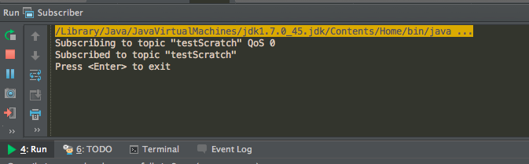

#Usage

* Step1: Scratch Extension
	1. Launch your Scratch Offline Editor.
	2. Click `File` with pressing shift, there will be an additional option `import experimental HTTP extension`.

	
	3. Choose `S4A.s2e` and import it, then you will see some new blocks in `More Blocks`.
	

* Step2: MQTT broker

	Launch an MQTT broker.
	
	

* Step3: scratch-mqtt Project
	1. Run `ScratchPublisher.java` to listen for Scratch signals and tranfer them to `Subscriber.java`. 	
	2. Run `Subscriber.java` to listen for tranferred data from `ScratchPublisher.java`.

	

* Step4: When click blocks on Scrach Editor to run. The result of receiving signal from Scratch Editor will show on ScratchPublisher.
* 
	
	
* [Demo](https://www.youtube.com/watch?v=LS80cD2ICdU)
